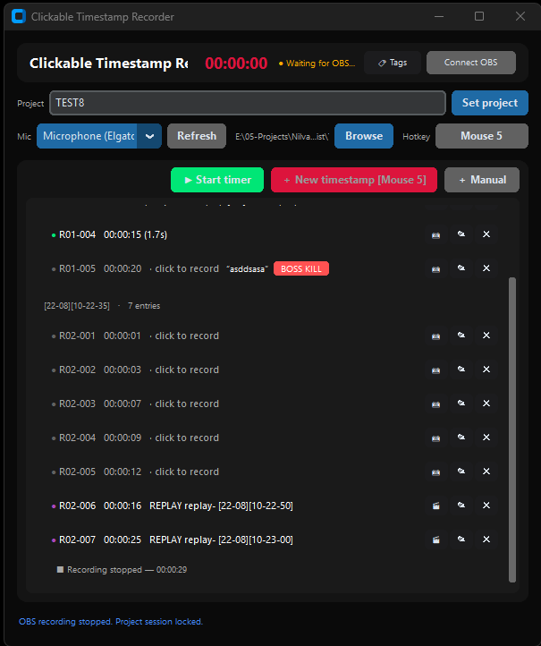

# Clickable Timestamp Recorder



A Windows-first desktop app that connects to OBS, starts its timer with OBS recording, and attaches microphone recordings to clickable timestamps.

## Features

- OBS WebSocket auto-connect with recording sync
- ▶/■ Built-in timer (works without OBS)
- Clickable timestamp workflow: pending → recording → playback
- Per-recording segment groups with restarting numbering
- Microphone WAV recording and playback
- Per-timestamp 720p screenshots
- Labels, tag library, and tag propagation
- Replay-buffer logging (passive)
- Recent projects for one-click switching
- Markdown project log with media links
- Configurable global hotkey (keyboard & mouse)
- Manual timestamps from typed time

## Project output

After choosing an output folder and project name:

```text
<output folder>/
└── My Project/
    ├── My Project.md
    ├── session.json
    ├── R01-001_00-12-34.wav
    ├── R01-002_00-18-05.wav
    └── Screenshots/
        ├── R01-001_00-12-34.jpg
        └── R01-002_00-18-05.jpg
```

Completed recordings are linked from the Markdown file, which groups timestamps under one section per OBS recording. Each timestamp that captured a screenshot embeds it directly below its entry:

```markdown
### [21-08][14-55-19]

- 001 [00:12:34](R01-001_00-12-34.wav) — completed, 4.2s — "Good take" #kill #bug
  - ![[R01-001_00-12-34.jpg]]
- 002 00:18:05 — pending
  - ![[R01-002_00-18-05.jpg]]
```

Labels are optional short notes, and tags come from the preset list in `keybinds.json`.

## Requirements

- Python 3.x on Windows
- OBS Studio with WebSocket enabled
- A microphone

Install dependencies:

```bash
python -m pip install customtkinter pynput obsws-python sounddevice mss pillow send2trash pyinstaller
```

Enable OBS WebSocket from **Tools → WebSocket Server Settings**. The default connection is `localhost:4455`; host, port, and password are stored in `keybinds.json`.

Connecting is automatic: while OBS is closed the header shows amber `● Waiting for OBS…` and the app retries every few seconds; once OBS starts it connects on its own, and if OBS exits mid-session it reconnects when OBS comes back. Clicking **Disconnect** pauses auto-connect until you click **Connect OBS** again.

## Run from source

```bash
python timestamp_gui.py
```

## Build the executable

```bash
pyinstaller --clean --noconfirm timestamp_gui.spec
```

The executable is created at `dist/timestamp_gui_lite.exe`. The spec bundles the PortAudio runtime required by microphone recording and the mss/Pillow runtime used by timestamp screenshots.

## Workflow

1. Choose an output folder.
2. Enter a project name and click **Set project**.
3. Select a microphone. If **System default** does not work, choose the explicit input device shown with its index/backend.
4. Change the timestamp hotkey if desired — click it, then press a key or Mouse 4/5 (Esc cancels).
5. Start recording in OBS — the app connects and follows automatically — or click **▶ Start timer** to run a session without OBS.
6. Press the timestamp hotkey or click **New timestamp**, or click **＋ Manual** to create one from a typed time. Each new timestamp also saves a small JPEG snapshot of your main monitor into the project's `Screenshots` folder.
7. Click a pending timestamp to start microphone recording.
8. Click the active timestamp to stop and save its WAV file.
9. Click a saved timestamp to play or stop it.
10. Use **✎** to add a label and tags to any timestamp, or **✕** to delete it (the WAV file and screenshot are deleted from disk too).
11. Save a replay buffer in OBS (default hotkey) while connected: it is logged automatically as a 🎬 REPLAY entry at the current time. Click it to record a microphone note exactly like a timestamp, use **🎬** on the row to watch the replay video, and **✎**/**✕** to tag or remove it.

Creating new timestamps requires a running timer — either an active OBS recording or the in-app **▶ Start timer** button. When no timer runs, existing timestamps stay fully usable: pending notes can still record audio and saved notes play back; only creating new entries waits for the next timer start.

Replay saves are logged even while the timer is stopped (they attach to the most recent segment), but a project must be selected — without one the save is only announced in the status bar.

Tip: click the **project name field** to reopen one of your five most recent projects instantly — each entry shows how many timestamps and recordings the project holds (read live from its log, not the folder path), and a 🗑 button deletes a project by moving its folder to the Recycle Bin after a confirmation. Typing a new name works as usual. If the app connects while OBS is already recording, it detects the active OBS recording and starts the timer after a project is selected; that segment's header falls back to `Recording N` until the recording stops and the real file name becomes known.

## Out of scope

This MVP intentionally does not include Gemini, DaVinci Resolve export, HUD overlays, video recording, in-app replay-buffer controls, transcription, or a database/server. (The app only *logs* OBS replay saves; it never starts/stops OBS outputs.) Per-timestamp screenshots were added by explicit product decision.

## License

MIT License; see [LICENSE](LICENSE).
